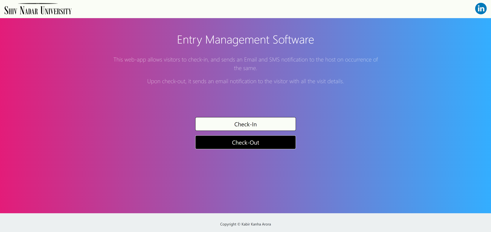
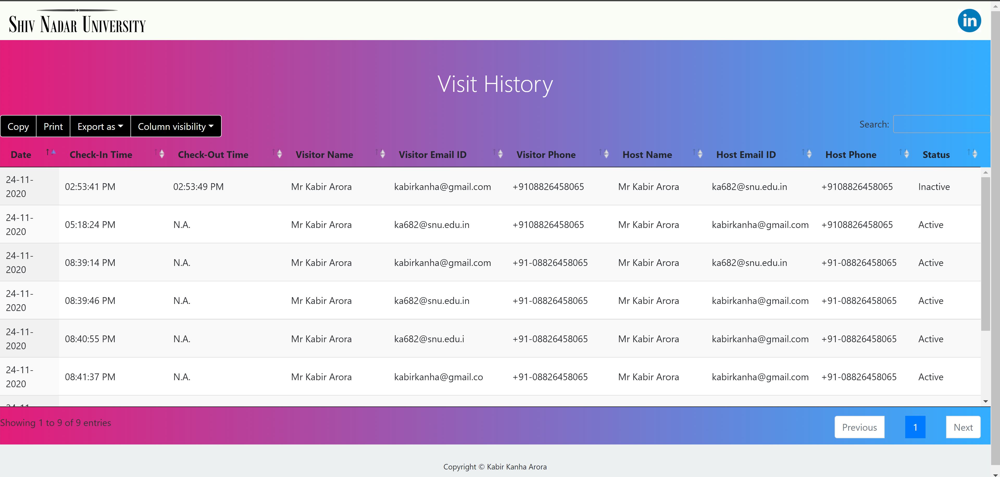

# entry-management-system

This repository serves to store my code for an **Entry Management System** (web-app). This code requires **no setup**. The deployment is at https://entry-management-system-kka.web.app/    

## Table of Contents

- [Project Overview](#Project-Overview)
- [Deployment](#Deployment)
- [Use Cases](#Use-Cases)
- [Features](#Features)
- [Overview](#Overview)
- [Tech Stack](#Tech-Stack)
- [Walk-through](#Walk-Through)
- [Future Scope and Improvements](#Future-Scope-And-Improvements)
- [A Note About The SMS API](#A-Note-About-The-SMS-API)
- [Contributors](#Contributors)

## Project Overview
An entry management system that will allow visitors to request a check-in, and check-out. Hosts are informed once the visitor checks in so as to get a prior notice. A log of all visits is maintained, and the admin has blacklisting rights too. This system would be hosted and deployed over Firebase. The USP of this project is the clean UI and the seamless
correspondence.

## Deployment

Before diving further into the details of the project, it is best that the reader goes through the project on their own. **No setup is required** and the project can simply be accessed here: https://entry-management-system-kka.web.app

For the admin panel, the credentials are:
- **Email**: ems.snu@gmail.com
- **Password**: password

_Please do not misuse these. It really serves no purpose to do so._

## Use Cases

The use cases for this kind of a portal are plenty. The focus is to build an application to be used at the entry in an office, but this can easily be extended and made suitable for residential complexes, hospitals, universities, and many more.

## Features

The main features that make up the backbone of this project include:

- Allowing a visitor to **check-in** by providing his/her details, along with those of his/her host.
- Allowing a visitor to **check-out** from the premises.
- Sending an **Email and SMS** notification to the host with visitor details.
- Sending an Email to the visitor with the details of the visit after check-out.
- Storing the data in **Firebase** in real-time.
- Allowing the portal to be accessible on the internet, by **deploying over Firebase**.
- Allowing the system administrator to view a **log of previous visits**, as well as being able to sort, filter and search on the historical records.
- Allowing the system administrator **blacklist** certain visitors to ban them from visiting the premises.

## Overview

Throughout the project, I have tried to maintain a very neat and uncluttered UI, which gives off a graceful and professional look.
The coding has been done in a modular manner that ensures easy flexibility and scalability. 
A [fully-functioning deployment](http://entry-management-system-kka.firebaseapp.com/) has already been created and requires **no setup**.

## Tech Stack

I have tried to use minimal variety in terms of tech stack to ensure flexibility. Given that constraint, I have managed to create a robust application that accomplishes all the desired features and requires no additional setup. Simply *click and go*.

I have used:
- **HTML** 
*to create the webpages and for basic arrangements.*
- **CSS** 
*to style the webpages.*
- **JavaScript** 
*for adding dynamic functionalities to the webpages.*
- **Firebase** 
*as the backend.*
- **Firestore** 
*for a real-time database.*
- **jQuery** 
*for sending ajax requests to send SMSes.*
- **EmailJS** 
*for sending emails to the host and the visitor.*
- **Fast2SMS API** 
*for sending SMS notifications to the host.*

## Walk-Through

When a visitor opens the [entry management software](http://entry-management-system-kka.firebaseapp.com/), he/she is faced with a *bouncing ball* loading screen that bridges the loading delay very smoothly.

  
The home page consists of two main options - **Check-In** and **Check-Out**.

  
If the visitor clicks on former, he/she is taken to the check-in page.

  
Here, he/she fills out the details of his visit and is notified whether his/her check-in was successful or not.

  
Upon successful check-in, the host receives an email informing them about the visitor who has arrived to meet them.

  
The host also receives an SMS regarding the same. Replies to this SMS have been disabled.

  
The check-in details are also added to the firebase database in real-time.

  
The details of this visit are also added to the visit history. The status is currently _Active_.

  
When the visitor is ready to leave, he/she simply visits the check-out page and types in his/her email ID.

  
The visitor is then notified whether the check-out was successful or not.

  
Upon successful check-out, the visitor receives an email giving him all the details of his visit for his perusal.

  
The visitor's entry is also retracted from the database in Firebase instantly.

  
Upon clicking the _cog wheel_ icon in the top right corner, the admin login page opens up.

  
Once successsfully logged in, the admin panel looks like this.

  
The admin can view a log of all past visits. He/She also has the ability to sort, filter and hide columns. He/she may also copy the file, print it, or export it to XLSX, CSV or PDF.

  
If needed, certain visitors may be blacklisted from the system, which would prevent them from trying to check-in in the future and also sends them an email informing them about the same.

  
Sample blacklist email.

  
The admin can also view the current blacklist and enjoys similar functionalities as those present in the visit log.

## Future Scope And Improvements

Given the time and inclination, some of the possible improvements/enhancements are:

- **Allowing a host to approve the visit, only then is the visitor fully checked-in to the system.**

    This is the logical next step. No entry management system is complete without authen-
tication. There has be to be a way to ensure that only those people who are actually
visiting someone are allowed inside. This can be implemented by sending a link to the
host, along with the Email/SMS, which can be clicked to approve the request.

- **Registering hosts on the site**

    The next step is to have a list of known hosts registered on the website, so that only
authentic persons are able to give approval to visitors.

- **Allowing a host to give prior approval to a visitor.**

    In order to avoid delays and approval-hassles, hosts can also have the option of pre-
approving certain visitors that they know about, or pre-approving regular visitors.

- **Allowing each employee to view a log of his/her own past visitors.**

    This can be easily implemented once each host is registered on the web-app and logged
in, by simply filtering and displaying the already existing historical records.

- **Automating a phone call to get approval from the host, in addition to Email and SMS, in case of no response.**

    Like the Email and SMS, a third-party API can be integrated with the application to achieve this functionality.

## A Note About The SMS API

I am using a trial account at the moment and while I am getting enough free credits to start with, a paid account will be required at a later stage when this product is finally deployed in the real world. (This holds true for the Email API too).

Please note that, as per **TRAI regulations**, *'promotional messages'* can only be sent to **non-DND numbers between 9AM and 9PM**. Messages sent after 9PM are automatically queued for 9AM for the following morning.

However, since any organisation that uses this tool would be using this as a *transactional* message and not a *promotional* message, it can submit the required documents that enable sending of messages to **all numbers and at all times**.

## Contributors

**Kabir Kanha Arora** 
[(LinkedIn)](https://www.linkedin.com/in/kabirkanha/)
